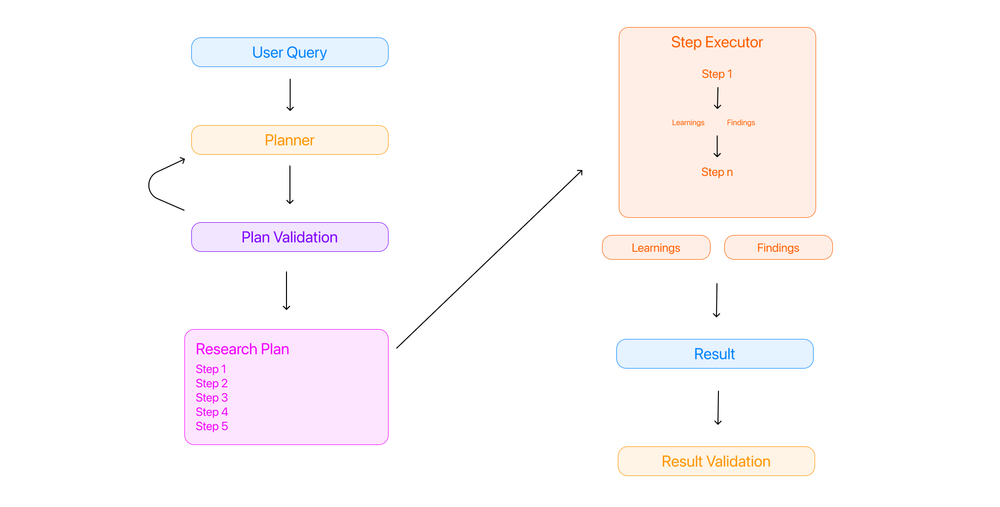

# Multi-Step Reasoning (MSR) Framework

A comprehensive agent-based framework that enhances the reasoning capabilities of foundation models through structured multi-step thinking processes and executable tools.



## Overview

The MSR Framework is designed to improve problem-solving capabilities of large language models by implementing a structured, agent-based approach to complex tasks. By breaking down problems into explicit reasoning steps with goal-oriented planning, the framework enables more reliable, transparent, and effective solutions across a variety of domains.

## Core Components

### Agent System

The framework revolves around an agent architecture with the following key components:

- **PlannerLLM**: Generates structured research plans with explicit goals and dependencies between steps
- **StepExecutor**: Executes individual steps with tool integration and robust error handling
- **Agent**: Orchestrates the planning and execution processes with proper state management

### Tool Integration

MSR supports multiple tool types to enhance agent capabilities:

- `PYTHON_EXECUTION`: Execute Python code for data analysis and computation
- `TERMINAL_COMMAND`: Run shell commands with security constraints
- `WEB_SEARCH`: Retrieve real-time information from the internet
- `FILE_OPERATIONS`: Read and write files securely
- `DATA_ANALYSIS`: Process and analyze structured data
- `VISUALIZATION`: Generate data visualizations and charts

### REST API Server

A Flask-based REST API server provides programmatic access to the MSR framework:

- Create and manage agent sessions
- Generate structured research plans
- Execute steps with or without approval workflows
- Monitor execution progress and retrieve results
- Comprehensive logging and security features

## Key Features

- **Structured Planning**: Generate detailed, multi-step plans with explicit goals for each step
- **Dependency Tracking**: Manage complex dependencies between steps for proper execution order
- **Comprehensive Logging**: Detailed logging system for tracking agent activities and debugging
- **Tool Integration**: Seamlessly integrate with various tools for enhanced capabilities
- **REST API**: Access all framework capabilities through a well-documented REST API
- **Security Controls**: Configurable security policies for tool execution and API access
- **State Management**: Robust state management for resuming interrupted executions

## Use Cases

- Complex mathematical reasoning
- Multi-hop question answering
- Logical puzzles and deduction tasks
- Programming and algorithmic problem solving

## Project Structure

- `src/`: Core implementation of the multi-step reasoning architecture
  - `models/`: Model configuration and adaptation for Qwen QWQ 32B
  - `reasoning/`: Implementation of reasoning steps and pipeline
  - `utils/`: Utility functions for prompts and other helpers
- `examples/`: Sample applications and demonstrations
- `eval/`: Evaluation frameworks and benchmarks
- `tests/`: Unit tests for components
- `scripts/`: Utility scripts for configuration and maintenance

## Getting Started

### Installation

```bash
# Clone the repository
git clone https://github.com/darwin-labs/MSR.git
cd MSR

# Install dependencies
pip install -r requirements.txt

# Install the package in development mode
pip install -e .

# Set up your API keys
cp .env.template .env
# Edit .env with your API keys
```

### Configuration

The MSR framework uses environment variables for configuration, which can be set in a `.env` file:

```
# LLM API Configuration
OPENROUTER_API_KEY="your-api-key"
DEFAULT_MODEL="anthropic/claude-3-opus-20240229"

# Server Configuration
MSR_SERVER_HOST="0.0.0.0"
MSR_SERVER_PORT="5000"
MSR_API_KEY="your-secure-api-key"
MSR_API_KEY_REQUIRED="true"

# Logging Configuration
MSR_LOG_LEVEL="INFO"
MSR_LOG_FILE="logs/msr_server.log"
```

### Running the Server

```bash
# Start the MSR REST API server
python -m src.server.server

# With custom configuration
python -m src.server.server --host 127.0.0.1 --port 8000 --log-level DEBUG --log-file logs/debug.log
```

### Using the Python Client

```python
from examples.server_client_example import MSRClient

# Create client instance
client = MSRClient("http://localhost:5000", api_key="your-api-key")

# Create an agent
agent_data = client.create_agent(
    task="Research the latest advancements in quantum computing",
    allowed_tools=["WEB_SEARCH", "PYTHON_EXECUTION"],
    model="anthropic/claude-3-opus",
    temperature=0.7
)

# Get agent ID
agent_id = agent_data["agent_id"]

# Generate a plan
plan = client.generate_plan(agent_id, max_steps=5)

# Execute the plan
results = client.execute_plan(agent_id)

# Print results
for step_result in results["results"]["execution_results"]:
    print(f"Step {step_result['step_id']}: {'Success' if step_result['success'] else 'Failed'}")
    print(f"Findings: {step_result['findings'][:100]}...")
```

### Running the Agent Example

```bash
# Run the agent example with web search and data analysis
python examples/agent_example.py "Analyze the impact of AI on healthcare in 2023" \
    --enable-web-search --enable-data-analysis --max-steps 5 \
    --log-file logs/agent.log --log-level INFO
```

## Documentation

- [API Reference](docs/api_reference.md): Comprehensive documentation of the REST API
- [Agent System](docs/agent_system.md): Detailed explanation of the agent architecture
- [Tool Integration](docs/tools.md): Guide to available tools and their capabilities
- [Configuration](docs/configuration.md): Configuration options and environment variables

## Contributing

Contributions are welcome! Please check out our [contributing guidelines](CONTRIBUTING.md) for details on how to get started.

## License

This project is licensed under the MIT License - see the [LICENSE](LICENSE) file for details. 
